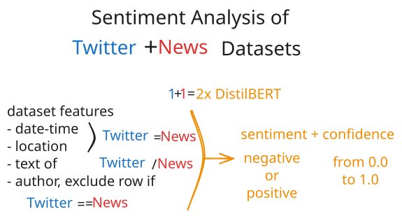

# Table of Contents

- [📖 Project Overview](#-project-overview)
- [👥 Roles and Responsibilities of Collaborators](#-roles-and-responsibilities-of-collaborators)
- [📊 Gather Data](#-gather-data)
- [🌍 Identify Global Events](#-identify-global-events)
- [⚙️ Process Data](#️-process-data)
- [🔧 How to Install](#-how-to-install)
- [📚 Glossary](#-glossary)

# 📖 Project Overview

[**SolarSoundBytes**](https://solar-sound-bytes.up.railway.app/) is a data-driven machine-learning project that explores the global sentiment towards **renewable energy** and **energy storage** in the timeframe from 2022-01-02 to 2024-12-24.

This project is a real-world application of the learnings acquired
during our 
[9-week bootcamp at Le Wagon](https://www.lewagon.com/barcelona/data-science-course) and was created during our final 2 weeks together in Barcelona from June 2 to 13, 2025.


## Input: Sentiment Analysis

Sentiment analysis is a well-known Natural Language Processing (NLP) technique used to determine the emotional tone of a text, classifying it as either positive, negative, or neutral. 

- The sentiment of the general public is being inferred by performing sentiment analysis on **130k+ public tweets (TODO link to dataset description)**. 
- Analogously, the sentiment of official channels is derived by sentiment analysis on **4k+ official news articles (TODO link to dataset description)**. 

By feeding the sentiment analysis results of these 2 datasets into an [interactive dashboard](https://solar-sound-bytes.up.railway.app/dashboard), the user is empowered to investigate possible
correlations between public and official sentiments as well as compare those data with further metrics. 

## Input: Additional Metrics

So far, two additional metrics to optionally overlay with sentiment analysis results have been implemented, covering the same timeframe from 2022-01-02 to 2024-12-24. 

1. Global capacity of renewable energy and energy storage technologies (TODO LINK AND NAME OF RENEWABLES DATASET). 
2. S&P 500 (TODO LINK AND NAME OF ECONOMIC DATASET)


## Output: SoundBytes

Based on custom user inputs compiled from the a chosen  timeframe of [sentiment analysis results](#input-sentiment-analysis) and optional overlay of [additional metrics](#input-additional-metrics), the user can trigger the creation of a customized **SoundByte**. 

A SoundByte is a short audio summary which turns the chosen data range into a simple and easily digestible explanation. Users can pick any combination of data streams for a specific time period to generate custom audio reports, making the complex and multi-layered topic of energy transition accessible to everyone.

To draw your own concusions, you can play with our extensive dataset using [our interactive dashboard](https://solar-sound-bytes.up.railway.app/dashboard).


# 👥 Roles and Responsibilities of Collaborators

| Name                  | GitHub                                                 | Role             | Content                                                                                                                                                               |
| --------------------- | ------------------------------------------------------ | ---------------- | --------------------------------------------------------------------------------------------------------------------------------------------------------------------- |
| Fadri Pestalozzi      | [@FadriPestalozzi](https://github.com/FadriPestalozzi) | Team Lead        | Documentation // Tweets on renewable energy: Research data sources, scraping and perform NLP                                                                          |
| Steffen Lauterbach    | [@steffenlaut](https://github.com/steffenlaut)         | System Architect | Create model pipeline and docker container to expose API // Research and process satellite images to detect and quantify solar panels //Integrate TTS (text-to-sound) |
| Enrique Flores Roldán | [@efloresr](https://github.com/efloresr)               | Project Manager  | News Articles: Research data sources // Create data processing pipeline, and tested models for NLP. // Fine tune distilber model for sentiment analysis.              |

# 📊 Gather Data

## News Articles from Cleantech Media Dataset

Online research for datasets of news-articles in the field of renewable energy
technologies led us to the
[Cleantech Media Dataset by Anacode](https://www.kaggle.com/datasets/jannalipenkova/cleantech-media-dataset).

- 20K articles in total
- Build a code for text processing: cleaning signs & digits, stopwords,
  lemmatize
  - 12,966 articles without a date. 2.5K Dates extracted from urls
  - **9,938** working articles (Europe only) (for MVP)

## **Training, Test & Evaluate**

- Tested different models for sentiment analysis.
  - [**distilbert-base-uncased-finetuned-sst-2-english**](https://huggingface.co/distilbert/distilbert-base-uncased-finetuned-sst-2-english)
    — Pos/Neg ONLY \*\*\*
  - [**cardiffnlp/twitter-roberta-base-sentiment-latest**](https://huggingface.co/cardiffnlp/twitter-roberta-base-sentiment-latest)
    — Pos/Neg/Netural
  - [**nlptown/bert-base-multilingual-uncased-sentiment**](https://huggingface.co/nlptown/bert-base-multilingual-uncased-sentiment)
    -- Optimized for reviews
  - [**Gemma 3**](https://huggingface.co/google/gemma-3-27b-it) — \*\*\*
- **First trial:** Very inaccurate — try again without too much preprocessing.
- **Second trial:** Still inaccurate — Analyse in sentences instead of entire
  article??? — divide data into chunks!
- **Third trial:** Still inaccurate — decided to fine tune a new model...

**\***GEMMA - VertexAI\*\*

- **Vertex AI SDK for Generative AI fine-tuning (Gemma models)** evolves very
  fast and the API keeps changing.
- Key methods like **fine_tune()** or **tune_model()** were either **missing,
  deprecated, or moved** to other parts of the library in different SDK
  versions.
- The **GenerativeModel.fine_tune()** method was not stable or consistently
  available, even after trying different setups (with Cloud Shell and pip
  installs).
- **Gemma is a chat / instruction-following model, not a task-specific model
  like DistilBERT or RoBERTa.**
- The new/recommended way to fine-tune Gemma now uses a **helper method** like
  aiplatform.model_garden.models.fine_tune_gemma(), which I started to implement
  but needed to refactore my code and so I decided to pivot.
- DIDN’T WORK —- MOVE ON!

## **Fine Tuning and Predict**

**\***Recommended model =
["distilbert/distilbert-base-uncased](https://huggingface.co/distilbert/distilbert-base-uncased)"\*\*

- Trained with labeled data and recommended model:
  - [_\*\*NewsArticles_ForTraining_](https://www.kaggle.com/datasets/clovisdalmolinvieira/news-sentiment-analysis)
    Dataset:\*\*
    - Dataset for training (no topic in specific)
    - **3.5K** news articles - labeled
  - **model = "distilbert/distilbert-base-uncased"**
    - Fine tuned with 3.5K articles labeled: Pos/Neg/Neut
    - Run a 1st test and score was bad:
      - loss:0.627
      - accuracy 0.782
    - Tweaked the parameters and run a 2nd test
      - loss = 0.37
      - accuracy = 0.796

## Conclusion:

- Pre-trained sentiment models performed poorly on CleanTech news articles.
- Tried advanced models (DistilBERT, Twitter-RoBERTa, Gemma); accuracy remained
  low or workflow too complex.
- Fine-tuning Gemma on Vertex AI failed due to unstable SDK APIs and . Also,
  **Gemma 3** is optimised for chat / instruction-following.
- Pivoted to fine-tuning **DistilBERT-base** with 3.5K labeled articles.
- Achieved ~0.80 accuracy after tuning.
- Conclusion: **Domain-specific fine-tuning is required** for reliable sentiment
  analysis on niche topics like CleanTech.

## Social Media Data from Twitter

To compare the sentiment of news articles to a broader public sentiment, we
looked for a fitting twitter dataset.

Although
[the Climate Change Twitter Dataset](https://www.kaggle.com/datasets/deffro/the-climate-change-twitter-dataset)
(15 million tweets spanning over 13 years) looked promising at first, we could
not use it due to the lack of full-text tweets within.

Since the
[vast majority](#futile-rehydration-attempt-of-climate-change-twitter-dataset)
of the most recent tweet_ids listed inside
[the Climate Change Twitter Dataset](https://www.kaggle.com/datasets/deffro/the-climate-change-twitter-dataset)
in GBR are no longer accessible, we abandoned our attempt to rehydrate this
dataset.

After extensive and unsuccessful further research for an alternative twitter
dataset, we decided to create our own twitter dataset as input for a social
media sentiment analysis using a
[scraping actor](https://console.apify.com/actors/CJdippxWmn9uRfooo) on
[console.apify](https://console.apify.com/).

As a tradeoff between scraping cost, time and scraping-content, a sampling
frequency of 1 day per month was chosen, applying an
[actor-specific](https://console.apify.com/actors/CJdippxWmn9uRfooo) format of
[scraping input parameters](data_acquisition/apify_twitter_sample_query.json).

### Rehydration of Climate Change Twitter Dataset

To test rehydration of
[the Climate Change Twitter Dataset](https://www.kaggle.com/datasets/deffro/the-climate-change-twitter-dataset),
a tweet-subset of 557,125 tweets with geolocation coordinates inside GBR was
selected.

Rehydration was performed in chunks of up to 10k tweets. As shown in below
table, the lack of data renders this rehydration attempt pointless.

| range of GBR-tweet-numbers of tweet_ids in scraping-chunk | number of successful rehydrations | rehydration percentage of tweet chunk |
| --------------------------------------------------------- | --------------------------------- | ------------------------------------- |
| 550,000 – 557,125                                         | 1                                 | 0.013%                                |
| 540,000 – 549,999                                         | 5                                 | 0.050%                                |
| 530,000 – 539,999                                         | 11                                | 0.110%                                |

### Scraping Twitter Dataset

To compile a twitter dataset covering the same topics as covered by the
[Cleantech Media Dataset](https://www.kaggle.com/datasets/jannalipenkova/cleantech-media-dataset),
the
[unique values in the cleantech "domains" column](preprocessing/scraping/cleantech_articles__unique_domains.txt)
are used as search terms for scraping with the chosen
[twitter scraper](https://console.apify.com/actors/CJdippxWmn9uRfooo).

To work with a user-friendly scraping GUI while keeping scraping costs below 40
USD/month, the following scraper was chosen:

- [Tweet Scraper|$0.25/1K Tweets | Pay-Per Result | No Rate Limits](https://console.apify.com/actors/CJdippxWmn9uRfooo/input?addFromActorId=CJdippxWmn9uRfooo).

Unfortunately, this chosen scraping method was unable to handle more than 2
search terms simultaneously.

Therefore, the
[initial list of search terms](preprocessing/scraping/cleantech_articles__unique_domains.txt)
was replaced with just 2 overarching [search terms](#search-terms) to generate a
twitter dataset with as large of a contextual overlap as possible with the
[Cleantech Media Dataset by Anacode](https://www.kaggle.com/datasets/jannalipenkova/cleantech-media-dataset).

### Search Terms

- renewable energy
- energy storage

# 🌍 Identify Global Events

To identify around which specific dates to refine the twitter dataset to zoom
into global events where a significant change in sentiment is highly probable, a
[deep research was performed by iteratively prompting ChatGPT 4.1](https://chatgpt.com/share/68495bc3-ee6c-8006-9816-8b0480a0bf3c).

The resulting overview with reasoning based on verified refererences is
available in a
[pdf](<notes/Global-Events-Influencing-Renewable-Energy-Sentiment-(2022–2024).pdf>)
and summarized in the [table below](#global-events-table). For detailed
references and reasoning, see the
[Global Events PDF](<notes/Global-Events-Influencing-Renewable-Energy-Sentiment-(2022–2024).pdf>).

## Global Events Table

| Date       | Event                                                                                                                                                                                                                | Country/Region | Expected Impact on Sentiment                 |
| ---------- | -------------------------------------------------------------------------------------------------------------------------------------------------------------------------------------------------------------------- | -------------- | -------------------------------------------- |
| 2022-02-24 | [Russian invasion of Ukraine](https://en.wikipedia.org/wiki/2022_Russian_invasion_of_Ukraine)                                                                                                                        | Global/EU      | Spike in interest and urgency for renewables |
| 2022-05-18 | [EU announces REPowerEU plan](https://ec.europa.eu/commission/presscorner/detail/en/IP_22_3131)                                                                                                                      | EU             | Positive sentiment for renewables            |
| 2022-08-16 | [US Inflation Reduction Act signed (major climate/energy provisions)](https://www.whitehouse.gov/briefing-room/statements-releases/2022/08/16/fact-sheet-the-inflation-reduction-act-supports-workers-and-families/) | USA            | Strong positive sentiment                    |
| 2023-04-20 | [IEA reports global solar power generation surpasses oil for the first time](https://www.iea.org/news/solar-overtakes-oil-in-global-power-generation)                                                                | Global         | Positive sentiment for solar, shift from fossil fuels |
| 2023-12-13 | [COP28 concludes with historic agreement to transition away from fossil fuels](https://unfccc.int/news/cop28-agrees-historic-deal-to-transition-away-from-fossil-fuels)                                             | Global         | Strong positive sentiment for renewables, policy optimism |
| 2023-11-30 | [Global installed solar PV capacity surpasses 1 terawatt milestone](https://www.pv-magazine.com/2023/11/30/global-installed-solar-capacity-surpasses-1-tw/)                                                        | Global         | Positive sentiment, milestone for solar industry      |


# ⚙️ Process Data

## Sentiment Analysis

### Methods



### Results

#### histogram confidence score vs sentiment color


#### sentiment score share over time


#### sentiment score share vs number of tweets over time


# 🔧 How to Install

## clone this repo to your computer

```shell
cd /path/to/your/project-parent-folder

git clone <paste_your_SSH_link_here>
```

## create virtual environment using python version according to [Le Wagon](https://www.lewagon.com/barcelona/data-science-course)

Separate local development environment from your global python environment to
define specific packages and versions.

```shell
# go to the project-folder
cd /path/to/SolarSoundBytes

pyenv virtualenv 3.12.9 SolarSoundBytes
```

## activate virtual environment in cloned repo

```shell
pyenv local SolarSoundBytes
```

## Install minimal packages

```shell
pip install --upgrade pip
pip install -r https://gist.githubusercontent.com/krokrob/53ab953bbec16c96b9938fcaebf2b199/raw/9035bbf12922840905ef1fbbabc459dc565b79a3/minimal_requirements.txt
pip list
```

## install requirements

```shell
pip install -r requirements.txt
```

## create data folder (untracked by .gitignore) and request data access from one of the authors

```shell
touch data
```

# 📚 Glossary

- **API**: Application Programming Interface – a set of rules that allows
  different software applications to communicate with each other.
- **GBR**: Great Britain
- **GUI**: Graphical User Interface – a visual way of interacting with a
  computer using items like windows, icons, and buttons.
- **MVP**: Minimum Viable Product – the simplest version of a product that can
  be released to test a new business idea and gather user feedback.
- **NLP**: Natural Language Processing – a field of artificial intelligence
  focused on the interaction between computers and human language.
- **PV**: Photovoltaic – technology that converts sunlight directly into
  electricity using solar cells.
- **TTS**: Text-to-Speech – technology that converts written text into spoken
  voice output.
- **USD**: United States Dollar


# 🥚 Easter Eggs

## Tagline

To break down the complexity of this project, we created 2 taglines using either raw brainpower or sprinkling in some AI guesswork.  

Now it's up to your human intuition to decide: 
Which tagline was written by a human and which one is the figment of an AI agent? 

Place your bets in our [TaglineTouringTest](https://form.typeform.com/to/Pqtp10qL) to figure out, if your subconscious chose the blue pill (just NetFlix and Chill) or the red pill (Ready to Face the Terminator)!